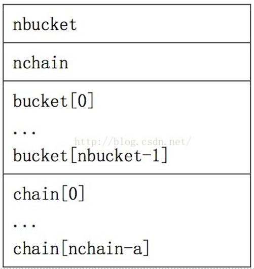

# SO文件中加密函数

## 简介

原理上来说，找到so文件函数的位置，对其二进制进行一定加密操作后即加密了；从section角度来说:

	+ .text 存放函数的具体实现
	+ .dynstr 存放函数名字
	+ .dynsym 相当于指针，存放每个函数实现代码(在.text)的地址
	+ .hash 描述.dynsym如何存储的，根据一定的算法可以映射到dynsym

__注意：__文中的提到的偏移是指在so文件头开始到任意一个位置的偏移

## section结构

.text和.dynstr没有固定的结构，存储的都是代码的值，.hash和.dynsym则是有固定的结构，后两者经过一定逻辑运算可以定位某个函数在前两者的具体的位置;还有一点，后面两个section从结构视图（section header）方面找到，需要从执行视图（program header）方便的找到，所以这里需要了解program header中的一个段.dynmaic的结构

### .dynmaic segemnet
这个段可以根据program header的type类型来确定，type为PT_DYNAMIC = 2

d_tag: 描述每个具体段的类型，如.hash .dynsym .dynstr等段，都可以根据d_tag来确定
d_val和d_ptr是一个联合体类型，共同占用4个字节，一个类型多种解释;
d_val: 表示d_tag对应段的大小size
d_ptr: 表示d_tag对应段的位置偏移	
该段结构如下：

```c
typedef struct dynamic{
  Elf32_Sword d_tag;
  union{
    Elf32_Sword        d_val;
    Elf32_Addr        d_ptr;
  } d_un;
} Elf32_Dyn;

```
找到这个.dynamic可以找到.hash .dynsym和.dynstr的偏移位置和大小

### .hash section

一般来说，经过如下操作可以定位到函数名字和函数实现代码
1. 函数字符串名字经过hash函数得到一个hash_value的值
2. 在.hash段中的nbucket，hash_value = hash_value % nbucket，hash段自身偏移加上hash_valuei + 8后偏移处读取4字节值，记为fun_index;__8表示开头的nbucket和nchain占用的字节__
3. 在.dynsym段中，.dynsym自身偏移 + fun_index * 16，为什么要乘以16,是因为dynsym每个结构占16个字节，这段偏移值的位置读取16个字节，转换微dynsym的elf_sym结构
4. elf_sym结构中有一个st_name，用.dynstr的偏移 + st_name的值作为偏移，读取偏移处的值，然后与我们要加密的函数名比较，相同就说明找到，没有的继续进行以下步骤
5. 计算hash的新偏移  funindex_offset = dyn_detail['hash_offset'] + 4 * (2 + nbucket + fun_index)，这句的意思就是要跳过以下hash结构的bucket[]数组，在chain中的fun_index位置出重新读取到新的fun_index_offset，乘4是因为每个数据占用4个字节，读取此处偏移得到新的fun_index
6. 重复3-4-5步骤，直到找到和函数名字相同的st_name为止




### .dynsym section

st_name对应的字符串和函数名相同后，就可以根据st_value和st_size进行函数结构加密了
```c
typedef struct elf32_sym{
  Elf32_Word        st_name;		#.dynstr_offset + st_name就是某个函数的具体偏移
  Elf32_Addr        st_value;		#st_value就是某个函数代码实现的偏移
  Elf32_Word        st_size;		#函数代码的长度
  unsigned char        st_info;
  unsigned char        st_other;
  Elf32_Half        st_shndx;
} Elf32_Sym;

```

## 脚本

### encode_so_function.py
这是我自己写的一个函数加密脚本，输入函数名字，可以自动找到函数对应的地发，然后进行加密，修改加密只需要改动其中的encode_fun(fun_sym)函数即可，参数事找到函数对应的那个dynsym结构，如上的结构

脚本使用方法：

```python
python encode_so_function.py so文件名 函数名
```


## C API 详解

```c
#include <unistd.h>  
#include <sys/mmap.h>  
int mprotect(const void *start, size_t len, int prot);  
```
mprotect()函数把自start开始的、长度为len的内存区的保护属性修改为prot指定的值。
prot可以取以下几个值，并且可以用“|”将几个属性合起来使用：
1）PROT_READ：表示内存段内的内容可写；
2）PROT_WRITE：表示内存段内的内容可读；
3）PROT_EXEC：表示内存段中的内容可执行；
4）PROT_NONE：表示内存段中的内容根本没法访问。
需要指出的是，指定的内存区间必须包含整个内存页（4K）。区间开始的地址start必须是一个内存页的起始地址，并且区间长度len必须是页大小的整数倍。
如果执行成功，则返回0；如果执行失败，则返回-1，并且设置errno变量，说明具体因为什么原因造成调用失败。错误的原因主要有以下几个：
1）EACCES
该内存不能设置为相应权限。这是可能发生的，比如，如果你 mmap(2) 映射一个文件为只读的，接着使用 mprotect() 标志为 PROT_WRITE。
2）EINVAL
start 不是一个有效的指针，指向的不是某个内存页的开头。
3）ENOMEM
内核内部的结构体无法分配。
4）ENOMEM
进程的地址空间在区间 [start, start+len] 范围内是无效，或者有一个或多个内存页没有映射。 
如果调用进程内存访问行为侵犯了这些设置的保护属性，内核会为该进程产生 SIGSEGV （Segmentation fault，段错误）信号，并且终止该进程。
